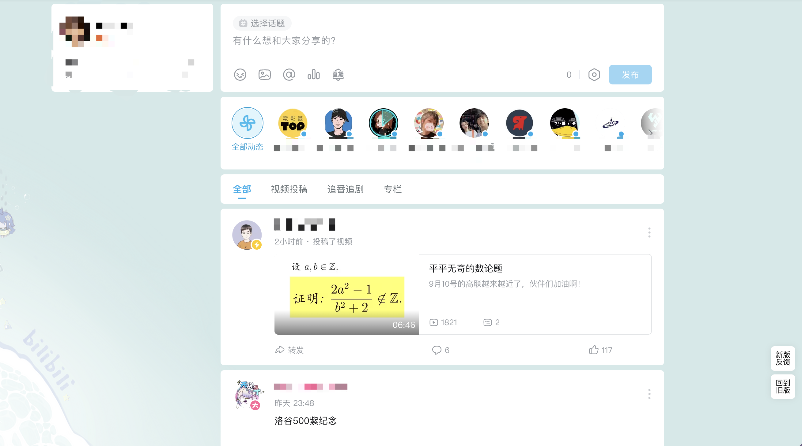

# better-bilibili

一个游猴脚本，净化bilibili

### 介绍

bilibili 净化脚本，对 b 站内的各种元素进行屏蔽。
特别是针对特征关键字（举例：广告、营销、游戏）的内容进行了屏蔽。代码中有相关注释，需要解除屏蔽的可以自行修改代码。

看见个人动态页面里面的各种广告、营销是不是很烦？可以设置关键字，统统屏蔽掉。

看见首页的某些系统推荐视频是不是很烦？可以设置关键字，统统屏蔽掉。

### 用户更新注意事项
1.

在更新前，请把在脚本中配置的屏蔽词数据自行拷贝出来，更新完脚本后再覆盖回去，以免造成个人的屏蔽词数据丢失。

在更新前，请把在脚本中配置的屏蔽词数据自行拷贝出来，更新完脚本后再覆盖回去，以免造成个人的屏蔽词数据丢失。

在更新前，请把在脚本中配置的屏蔽词数据自行拷贝出来，更新完脚本后再覆盖回去，以免造成个人的屏蔽词数据丢失。

2.

由于项目尚未对屏蔽内容实现操作界面，所以需要解开屏蔽的，请自行在代码中搜索相关中文，在对应代码内容前面加上 // 注释，注释掉即可。

### 其他注意事项

- 视频播放页右侧的推荐视频列表，虽然可以屏蔽，但是 b 站对播放列表和视频选集做了代码上的关联，屏蔽推荐视频列表会导致视频选集数据无法显示。所以，默认设置是不屏蔽。
如果需要屏蔽，可以自己在脚本中进行相关改动。

### 屏蔽元素包括

- 首页-各种页面元素

- 首页-广告

- 首页-直播

- 首页-导航栏左侧

- 首页-导航栏右侧若干图标

- 首页-视频标题中的特征关键词。代码中为 blackList。可自行修改关键词，修改后保存脚本即可。
该屏蔽会导致首页中出现空白块，会影响观感。对此介意的可以把相关代码注释掉。

- 首页-推荐

- 首页-视频点赞数量标签

- 首页-页面滑动板块

- 首页-热门

- 搜索栏-默认搜索词

- 搜索栏-历史记录

- 顶部菜单栏-右边若干元素

- 视频播放页-各页面元素

- 视频播放页-记笔记、投诉、分享等页面元素

- 视频播放页- up 主头像

- 视频播放页-充电

- 视频播放页-广告

- 视频播放页-直播

- 视频播放页-下方标签

- 视频播放页-右侧视频推荐列表（默认不屏蔽。因为 b 站自己的缘故，会导致视频选集数据显示异常，影响视频观看。）

- 视频播放页-播放过程中途出现的各种投票等窗口

- 个人动态页-特征关键词。代码中为 dynBlackList。可自行扩充关键词，修改后保存脚本即可。

- 个人动态页-投票

- 个人动态页-预约

- 个人动态页-右侧话题栏

- 直播房间-礼物栏

- 直播房间-视频下方区域

- 直播房间-视频上方信息区

- 直播房间-页面底部bilibili公司信息区域

- 直播房间-bilibili娘

- 直播房间-pk横幅

- 直播房间-pk结果

- 直播房间-pk特效

- 直播房间-横幅特效

- 直播房间-弹幕欢迎特效

- 直播房间-粉丝牌、等级牌、头衔牌等

- 直播房间-舰长列表

- 直播房间-小游戏

### 效果图

